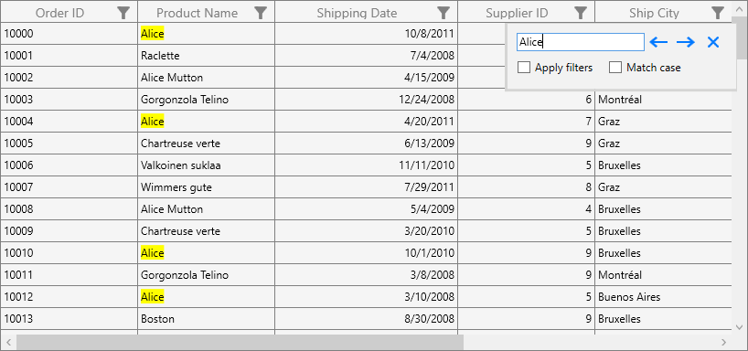

# How to search the whole word in WPF DataGrid (SfDataGrid)?

## About the sample

This sample illustrates how to search the whole word in WPF DataGrid.

[WPF DataGrid](https://www.syncfusion.com/wpf-ui-controls/datagrid) (SfDataGrid) provides support to search the data by using SearchHelper. Now, the cell values which contains the search text will be highlighted. For example, if the search text is “Alice” and the DataGrid contains the values “Alice” and “Alice Mutton” in two different cells, the search text Alice in both the cells will be highlighted.

You can change this behavior to highlight the cell only if the cell value is completely same as the search text. That is, only the cell with the text “Alice” will be highlighted. This can be achieved by creating a custom SearchHelper and apply Equals search instead of Contains search.


```c#
public MainWindow()
{
    InitializeComponent();
    this.dataGrid.SearchHelper = new CustomSearchHelper(this.dataGrid);
}

public class CustomSearchHelper : SearchHelper
{
    public CustomSearchHelper(SfDataGrid dataGrid) : base(dataGrid)
    {

    }

    
    protected override bool ApplyInline(DataColumnBase column, object data, bool ApplySearchHighlightBrush)
    {
        var tempSearchText = SearchText;
        String[] metaCharacters = { "\\", "^", "$", "{", "}", "[", "]", "(", ")", ".", "*", "+", "?", "|", "<", ">", "-", "&" };
        if (metaCharacters.Any(tempSearchText.Contains))
        {
            for (int i = 0; i < metaCharacters.Length; i++)
            {
                if (tempSearchText.Contains(metaCharacters[i]))
                    tempSearchText = tempSearchText.Replace(metaCharacters[i], "\\" + metaCharacters[i]);
            }
        }

        string[] substrings;
        Regex regex;

        if (!AllowCaseSensitiveSearch)
            regex = new Regex("^(" + tempSearchText + ")$", RegexOptions.IgnoreCase);
        else
            regex = new Regex("^(" + tempSearchText + ")$", RegexOptions.None);

        //get all the words from the 'content'

        FrameworkElement columnElement = (FrameworkElement)column.GetType().GetField("columnElement", System.Reflection.BindingFlags.NonPublic | 
            System.Reflection.BindingFlags.Instance).GetValue(column);
        var textBlock = (columnElement as ContentControl).Content as TextBlock;
        textBlock.Inlines.Clear();
        substrings = regex.Split(data.ToString());
        bool success = false;
        foreach (var item in substrings)
        {
            if (regex.Match(item).Success)
            {
                Run run = new Run(item);
                if (ApplySearchHighlightBrush || column.ColumnIndex == CurrentRowColumnIndex.ColumnIndex && column.RowIndex == CurrentRowColumnIndex.RowIndex)
                {
                    if (this.ReadLocalValue(SearchHelper.SearchForegroundHighlightBrushProperty) != DependencyProperty.UnsetValue)
                        run.Foreground = this.SearchForegroundHighlightBrush;
                    run.Background = this.SearchHighlightBrush;
                }
                else
                {
                    if (this.ReadLocalValue(SearchHelper.SearchForegroundBrushProperty) != DependencyProperty.UnsetValue)
                        run.Foreground = this.SearchForegroundBrush;
                    run.Background = this.SearchBrush;
                }
                if (column.GridColumn is GridHyperlinkColumn)
                    textBlock.Inlines.Add(new Hyperlink(run));
                else
                    textBlock.Inlines.Add(run);
                success = true;
            }
            else
            {
                if (column.GridColumn is GridHyperlinkColumn)
                    textBlock.Inlines.Add(new Hyperlink(new Run(item)));
                else
                    textBlock.Inlines.Add(item);
            }
        }
        return success;
    }
}
```



## Requirements to run the demo
Visual Studio 2015 and above versions
